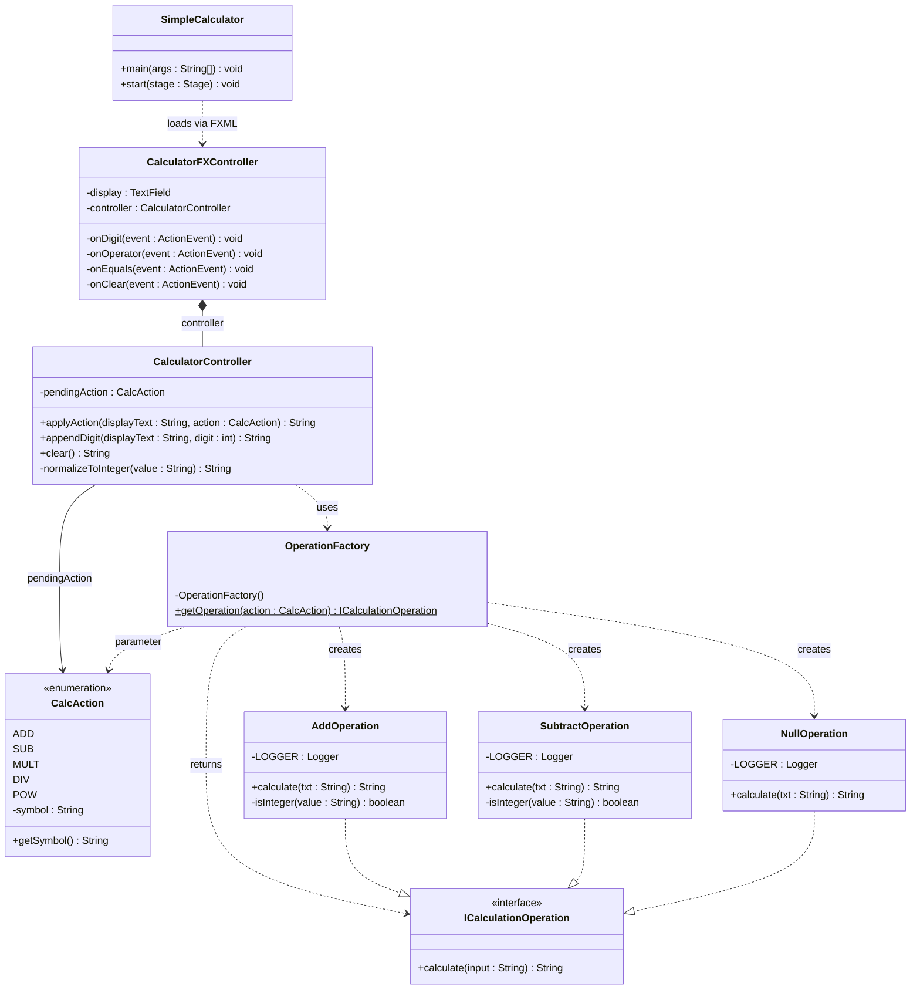

# UML Class Diagram

```mermaid
classDiagram
    direction TB

    class SimpleCalculator {
        +main(args : String[]) void
        +start(stage : Stage) void
    }

    class CalculatorFXController {
        -display : TextField
        -controller : CalculatorController
        -onDigit(event : ActionEvent) void
        -onOperator(event : ActionEvent) void
        -onEquals(event : ActionEvent) void
        -onClear(event : ActionEvent) void
    }

    class CalculatorController {
        -pendingAction : CalcAction
        +applyAction(displayText : String, action : CalcAction) String
        +appendDigit(displayText : String, digit : int) String
        +clear() String
        -normalizeToInteger(value : String) String
    }

    class CalcAction {
        <<enumeration>>
        ADD
        SUB
        MULT
        DIV
        POW
        -symbol : String
        +getSymbol() String
    }

    class ICalculationOperation {
        <<interface>>
        +calculate(input : String) String
    }

    class OperationFactory {
        -OperationFactory()
        +getOperation(action : CalcAction)$ ICalculationOperation
    }

    class AddOperation {
        -LOGGER : Logger
        +calculate(txt : String) String
        -isInteger(value : String) boolean
    }

    class SubtractOperation {
        -LOGGER : Logger
        +calculate(txt : String) String
        -isInteger(value : String) boolean
    }

    class NullOperation {
        -LOGGER : Logger
        +calculate(txt : String) String
    }

    SimpleCalculator ..> CalculatorFXController     : loads via FXML
    CalculatorFXController *-- CalculatorController : controller
    CalculatorController ..> OperationFactory       : uses
    CalculatorController --> CalcAction             : pendingAction
    OperationFactory ..> CalcAction                 : parameter
    OperationFactory ..> AddOperation               : creates
    OperationFactory ..> SubtractOperation          : creates
    OperationFactory ..> NullOperation              : creates
    OperationFactory ..> ICalculationOperation      : returns
    AddOperation      ..|> ICalculationOperation
    SubtractOperation ..|> ICalculationOperation
    NullOperation     ..|> ICalculationOperation
```
